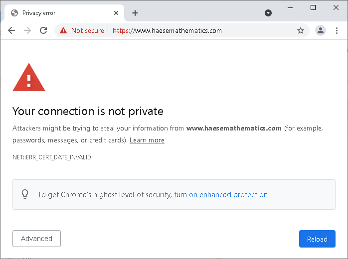

# Certificate errors when visiting our websites

6th October 2021

We are aware of a problem that is preventing some of our customers from
visiting our websites, including <https://www.haesemathematics.com/> and
<https://snowflake.haesemathematics.com.au/>.

Due to the expiration of a global security certificate on the 30th of September
2021, some older versions of operating systems (such as Microsoft Windows and
Apple macOS) and web browsers (such as Google Chrome and Safari) are no longer
able to confirm that our websites are secure.

As a result, web browsers might show a warning or error message like the
following (from Google Chrome on Windows), and restrict or completely block
access to the website:

This is a widespread problem that affects many websites globally -- those that
use the [Let's Encrypt](https://letsencrypt.org) certification authority to
secure web access.

Let's Encrypt has taken steps to prevent the expired certificate from affecting
the majority of clients, but those steps depend on relatively up-to-date
software being used.

## Possible solutions

**Note**: if you are experiencing the problem while using a work or school
computer (and/or while connected to a work or school network), please consult
with your IT support team first, for these main reasons:

1. They are best placed to help you with the particular setup of your computer
   and network connection, and may be the only people with the required level
   of access to make changes.

2. There may be devices on the network (other than your computer) that need to
   be updated to resolve the problem.

Some relatively safe options to try, in order:

1. Please make sure that the time and date on your computer are correct.
    - A time or date offset can cause problems when checking the validity of
      certificates.  For example, the
      [`NET::ERR_CERT_DATE_INVALID` error message in Google Chrome](https://support.google.com/chrome/answer/6098869?hl=en#zippy=%2Cyour-clock-is-behind-or-your-clock-is-ahead-or-neterr-cert-date-invalid)
      can appear because of such an offset.

2. Please make sure that your web browser, anti-virus or security software, and
   operating system are up to date.
    - Pending updates may include the required new Let's Encrypt certificate.
    - It is a security risk to use out of date software.
    - Note that Microsoft Windows 7
      [no longer receives updates](https://www.microsoft.com/en-au/windows/windows-7-end-of-life-support-information)
      (except by special arrangement with Microsoft).

3. Please try using a different web browser.
    - Recent versions of
      [Mozilla Firefox](https://www.mozilla.org/en-US/firefox/new/)
      are known to work, because they bundle their own set of certificates.

If you are still having trouble, please write to us at
<itsupport@haesemathematics.com> with the details of the problem (including
screenshots, if possible), your operating system and web browser versions, and
details of the steps that you have tried.

## Technical details and further information

The _DST Root CA X3_ root certificate, which was originally used to sign the
main Let's Encrypt root certificate (_ISRG Root X1_) expired on the 30th of
September 2021.  As a result, this chain of trust is no longer valid (except on
Android in certain circumstances):

1. _DST Root CA X3_
2. _ISRG Root X1_
3. _Let's Encrypt R3_
4. _www.haesemathematics.com_, _snowflake.haesemathematics.com.au_, etc

The new chain of trust requires the _ISRG Root X1_ certificate to be installed
as a root certificate on client devices, which might not be the case with older
software:

1. _ISRG Root X1_
2. _Let's Encrypt R3_
3. _www.haesemathematics.com_, _snowflake.haesemathematics.com.au_, etc

[This Let's Encrypt article](https://letsencrypt.org/docs/dst-root-ca-x3-expiration-september-2021/)
explains the situation in detail.  As that page will likely be inaccessible if
you are experiencing the problem in question,
[here is a link via the Internet Archive](https://web.archive.org/web/20210930161135/https://letsencrypt.org/docs/dst-root-ca-x3-expiration-september-2021/)
that should be more accessible.
